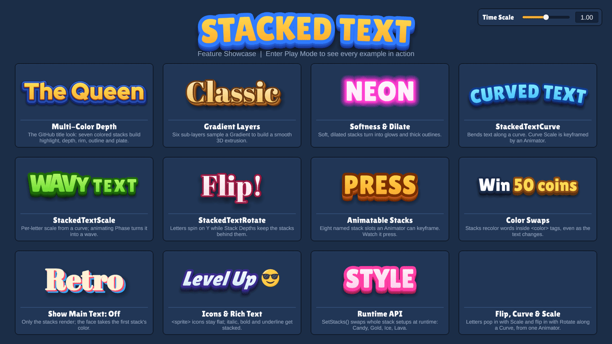

<p align="center">
  
</p>

<p align="center"><b>Stylized layered text effects for TextMeshPro in Unity</b></p>

StackedText is a lightweight Unity component that generates stacked, multi-layered text with customizable colors, offsets, softness, and dilation — all driven by a single `TMP_Text` component and rendered in a single draw call. Optional sibling modules add per-character bending, scaling, Y-axis rotation, and animation-clip-friendly stack slots. Perfect for game titles, UI headers, and stylized labels.

Everything in the GIF above ships as a ready-to-use prefab in the included [showcase scene](#showcase-scene).

---

## Feature Showcase

Reading the GIF left to right, top to bottom:

1. **Multi-Color Depth** (`StackedText_TheQueen`) — A complete game-title look built from seven stacks. From front to back: a cream highlight along the top edge, the orange face depth, a thin navy rim, the blue outline with a darker bottom edge, a light-blue rim, a navy back plate and a soft shadow. Each stack is just a color, an offset and a dilate value.
2. **Gradient Layers** (`StackedText_GradientLayers`) — One stack with **Layer Count** 6 and offsets that step diagonally down and to the right. Each sub-layer samples the stack's `Gradient`, from warm gold near the letters to dark brown at the back, for a smooth 3D extrusion.
3. **Softness & Dilate** (`StackedText_SoftnessDilate`) — "NEON" is three stacks with no offset and growing dilate and softness: a pink core, a pink bloom and a wide purple haze. Dilate grows a stack's shape and softness blurs its edge, which is all a glow needs.
4. **StackedTextCurve** (`StackedText_Curve`) — The text bends along an arch. An Animator keyframes **Curve Scale** from positive to negative, so it flexes from a frown to a smile. Letters tilt with the curve and every stack bends with them.
5. **StackedTextScale** (`StackedText_ScaleWave`) — Each letter's scale is sampled from a looping wave curve. Keyframing **Phase** slides the wave through the text, so letters swell and shrink in turn, and their stacks scale with them.
6. **StackedTextRotate** (`StackedText_RotateFlip`) — As **Phase** sweeps across "Flip!", each letter makes a full turn on its Y axis. **Stack Depths** push three dark stacks further back along each letter's rotated Z axis, so letters show real thickness when they turn edge-on.
7. **Animatable Stacks** (`StackedText_AnimatableStacks`) — "PRESS" behaves like a 3D button. An Animator keyframes the extrusion and shadow slots of `StackedTextAnimatableStacks` together with the text's position, so the letters sink while the depth under them shortens.
8. **Color Swaps** (`StackedText_ColorSwaps`) — Words in `<color=#hex>` tags get their own stack colors: each stack maps the gold, ruby and ice tag colors to matching dark outline and depth shades. A small script cycles the message at runtime, and the swaps follow the tags.
9. **Show Main Text: Off** (`StackedText_ShowMainTextOff`) — Only the stacks render, and the face takes the first stack's color. A cream face with coral and blue offset copies gives "Retro" a misregistered-print look.
10. **Icons & Rich Text** (`StackedText_IconsRichText`) — `<sprite>` icons render as single, un-stacked quads next to the stacked text, while italic (and bold or underlined) text stacks like any other glyph.
11. **Runtime API** (`StackedText_RuntimePresets`) — A script calls `SetStacks()` every 1.5 seconds, swapping the whole stack setup and fill gradient between Candy, Gold, Ice and Lava presets.
12. **Flip, Curve & Scale** (`StackedText_FlipCurveScale`) — The modules combined into a title reveal. Scale and Rotate share one keyframed **Phase**, so a reveal front sweeps across "Grand Prize": each letter pops in from zero with a slight overshoot and turns from edge-on to face-on, while Curve holds the line on an arch. It loops every 3 seconds.

Around the cards, the **STACKED TEXT** header (`StackedText_Title`) pairs a Curve arch with a slow Scale "breathing" wave. The **Time Scale** control in the corner slows down, freezes or speeds up every animation, so you can study each effect frame by frame.

### More examples

<p align="center">
  
  
</p>
<p align="center">
  
  
</p>

---

## Features

- **Single Drawcall** — Embeds the parameters into texcoord3 channel to achieve single drawcall.
- **Multiple Stack Layers** — Add as many stacks as you need, each with independent settings.
- **Per-Layer Gradient Colors** — Assign a `Gradient` to each stack for smooth color transitions across layers.
- **Configurable Offsets** — Set start and end offsets per stack to control the direction and depth of the effect.
- **Softness & Dilation** — Fine-tune the edge softness and thickness of each layer independently.
- **Rich-Text Color Swaps** — Give `<color=#hex>` tagged words their own stack colors with per-stack Source → Target color pairs.
- **Optional modules** — Mix and match `StackedTextCurve` (arc-bend), `StackedTextScale` (per-character scale), `StackedTextRotate` (per-character Y-axis rotation + stack depth), and `StackedTextAnimatableStacks` (8 named stack slots that can be keyframed by Animation clips). All modules are sibling components — add the ones you need.
- **Editor Preview** — Runs in Edit Mode via `[ExecuteInEditMode]`, so you see results instantly without entering Play Mode.
- **Zero Allocation at Runtime** — Reuses cached lists and meshes to avoid GC pressure during updates.
- **Automatic Material Setup** — Detects and creates a compatible `Distance Field Dilate` material if one isn't assigned.
- **Material Inspector** — `Distance Field Dilate` materials get a TMP-style inspector (`TMP_SDF_DilateShaderGUI`) with Face, Outline, Underlay, Lighting, Glow and Debug panels.
- **Unity 6 Ready** — One shader for both TMP vertex layouts: the `com.unity.textmeshpro` 3.x package (Unity 2021.3 / 2022.3) and the TextMeshPro built into `com.unity.ugui` 2.x (Unity 2023.2+ / Unity 6).
- **Fallback asset & Icon support** — Supports fallback assets & TMP icons by default. Compatible with RTL languages as well.
- **Animation Clip Support** — Change every numeric field via Animation clips to create dynamic effects, including the 8 fixed slots on `StackedTextAnimatableStacks`.
- **Showcase Scene** — A ready-to-play demo scene with a prefab for every feature, using three example fonts (see [Showcase Scene](#showcase-scene)).

---

## Requirements

| Dependency         | Requirement |
|--------------------|---|
| Unity              | 2021.3+ (including Unity 6) |
| TextMeshPro        | `com.unity.textmeshpro` 3.x, or the TextMeshPro built into `com.unity.ugui` 2.x |
| TMP Essential Resources | Imported at the default `Assets/TextMesh Pro/` location — the shader includes `Assets/TextMesh Pro/Shaders/TMPro.cginc` |

---

## Installation

- **Unity package** — download [`StackedText_v1.4.0.unitypackage`](StackedText_v1.4.0.unitypackage) and import it with **Assets › Import Package › Custom Package…**. Everything goes to `Assets/Unity-Stacked-Text`.
- **Git** — clone the repository (or add it as a submodule) anywhere under `Assets/`. The repository includes the `.meta` files, so asset references match the package.

---

## Quick Start

1. Add a **TextMeshPro** text object to your scene (UI or World Space).
2. Add the **StackedText** component to the same GameObject.
3. The `Text` field auto-populates. If not, drag your `TMP_Text` reference in.
4. Add entries to the **Stacks** list to create new stack layers.
5. Configure each stack's **Color**, **Start/End Offset**, **Softness**, and **Dilate** to taste, and optionally add **Color Swaps** for `<color>`-tagged words.
6. (Optional) Add any of the sibling modules to the same GameObject:
   - **StackedTextCurve** — bend the text along an arc.
   - **StackedTextScale** — scale each character along an `AnimationCurve` sampled by horizontal position.
   - **StackedTextRotate** — rotate each character on its Y axis along a curve, and optionally push individual stacks "behind" along the rotated local Z.
   - **StackedTextAnimatableStacks** — exposes 8 fixed `StackConfig` fields by name so an `Animator` can keyframe them.

The `StackedText` component auto-collects all sibling modules on enable and on validate; you usually don't need to wire references manually.

---

## Showcase Scene

Open `Examples/Scenes/StackedText_Showcase.unity` and press **Play** to see the scene from the GIF. In Edit Mode the animated examples rest on their first frame. Every card is a prefab in `Examples/Prefabs` (see [Feature Showcase](#feature-showcase)), ready to drop into your own UI.

```
Examples/
├── Scenes/      StackedText_Showcase.unity
├── Prefabs/     one prefab per card, plus the StackedText_Title header
├── Animations/  looping clips and controllers for the animated examples
├── Fonts/       Lilita One, Abril Fatface and Red Hat Display Black: .ttf, OFL.txt, SDF font asset and "- StackedText" material
└── Scripts/     StackedTextShowcaseTextCycler, StackedTextShowcasePresetCycler, StackedTextShowcaseTimeScale (demo helpers)
```

- The **Time Scale** control in the top-right corner (a slider plus a text field for exact values, up to 10×) slows down, freezes or speeds up every animation in the scene. It adds the UI input module that matches the project's input handling (Input Manager or Input System package) at runtime.
- The canvas is **Screen Space – Camera** with a perspective camera, so the Rotate example's depth reads as 3D.
- The cards use three fonts: Lilita One, Abril Fatface, and Red Hat Display Black (the font of the original screenshots, used for "The Queen" and "Grand Prize").
- Card descriptions use `LiberationSans SDF` and the icon uses the default `EmojiOne` sprite asset, both from **TMP Essential Resources**.
- The example assets were authored in Unity 6. The core scripts and shader still support 2021.3+.
- The font assets are static 1024 × 1024 SDF atlases with about 27% padding, which leaves room for thick dilated outlines. Regenerate them from the included `.ttf` files if you need more characters.
- **Fonts**: [Lilita One](https://fonts.google.com/specimen/Lilita+One) by Juan Montoreano, [Abril Fatface](https://fonts.google.com/specimen/Abril+Fatface) by TypeTogether and [Red Hat Display](https://github.com/RedHatOfficial/RedHatFont) by The Red Hat Project Authors, all under the SIL Open Font License 1.1 (`OFL.txt` next to each font).
- Don't need the demo? Delete the `Examples` folder; nothing else depends on it.

---

## Stack Configuration

Each `StackConfig` entry exposes the following:

| Property | Description |
|---|---|
| **Enabled** | Toggle this stack on or off. |
| **Layer Count** | Number of sub-layers in this stack (1–6). More layers = smoother gradient transitions. |
| **Color** | A `Gradient` sampled across the sub-layers. |
| **Start Offset** | Position offset of the first (back-most) sub-layer. |
| **End Offset** | Position offset of the last (front-most) sub-layer. |
| **Softness** | Edge softness of the stack layers (0–1). |
| **Dilate** | Thickness adjustment of the stack layers (-1 to 1). |
| **Color Swaps** | Optional list of `Source` → `Target` color pairs, applied to characters inside `<color>` rich-text tags (see below). |

The **main text** sits on top of all stacks and has its own **MainTextSoftness** and **MainTextDilate** controls. Toggle **Show Main Text** off to hide the front layer and display only the stacks.

### Color Swaps

By default every character gets the same stack colors, even when the main text is recolored with rich-text tags. Color Swaps let tagged words carry their own stack colors: when a character is wrapped in a `<color=#RRGGBB>` tag whose RGB matches a swap's `Source`, that stack's layers use the swap's `Target` color (including its alpha) instead of the gradient. The main text keeps the tag color.

```
Text:           Collect <color=#FFD200>50 coins</color>!
Stack 0 swaps:  Source #FFD200 → Target #8A5A00
```

"50 coins" gets a dark-gold stack while the rest of the text uses the stack gradient. Swaps are per stack, so each stack can recolor differently. They need **Rich Text** enabled on the text and match unquoted hex colors only (`<color=#FFD200>`, `<color=#FFD200FF>`); quoted or named colors (`<color="#FFD200">`, `<color=red>`) are not matched.

---

## Curve Component (`StackedTextCurve`)

Bends the text vertices along an arc by sampling an `AnimationCurve` over the text's normalized X axis.

| Property | Description |
|---|---|
| **Curve** | An `AnimationCurve` defining the arc shape. |
| **Curve Scale** | Multiplier for the curve's vertical displacement. |
| **Keep Text Centered** | Offsets the curve so the midpoint stays at the baseline. |
| **Reference Width** | Overrides the text bounds width for curve calculations. Useful for consistent arcs across varying text lengths. |

---

## Scale Component (`StackedTextScale`)

Scales each character around its baseline midpoint based on its position along the text's normalized X axis. The curve's `Y` value is used directly as the scale multiplier (1 = original size, 0 = collapsed, 2 = double).

| Property | Description |
|---|---|
| **Curve** | An `AnimationCurve` whose value is the scale multiplier per character. |
| **Phase** | Shifts the curve evaluation along the X axis (value is divided by 10 internally). |
| **MirrorAlongX** | Sample the curve right-to-left instead of left-to-right. |
| **Reference Width** | Overrides the text bounds width used to normalize character positions. |

Scale is applied **after** Curve and Rotate so it composes multiplicatively — at scale = 0 the character collapses cleanly to its pivot regardless of which other modules are active.

---

## Rotate Component (`StackedTextRotate`)

Rotates each character around its baseline midpoint on the **Y axis** based on its position along the text. Designed to look correct under a perspective camera (Z displacement is meaningful); under Screen Space – Overlay you'll see the X-squash component but not depth.

| Property | Description |
|---|---|
| **Curve** | An `AnimationCurve` whose value is the rotation in **quarter turns**: `1` = 90°, `0.5` = 45°, `4` = a full 360°. |
| **Phase** | Shifts the curve evaluation along the X axis (value is divided by 10 internally). |
| **MirrorAlongX** | Sample the curve right-to-left instead of left-to-right. |
| **StackDepths** | Optional `List<float>` that adds a per-stack Z offset, indexed by stack order in `StackedText.Stacks`. The offset is pushed along each character's **rotated local Z axis**, so as a character rotates its stacks stay "behind" it. Use negative values to recede. Stacks without a corresponding entry get Z = 0. |

---

## Animatable Stacks Component (`StackedTextAnimatableStacks`)

Unity's Animation system can keyframe **named serialized fields** on a component but cannot reliably address individual elements inside a `List<T>` — list-element binding paths are not stable across resizes. This module exposes **8 fixed `StackConfig` fields** named `Stack0` through `Stack7` so each one (and its sub-fields like `StartOffset`, `Dilate`, `Enabled`, etc.) can be bound by an `Animator`.

When the module is present and enabled on the same GameObject as `StackedText`, its 8 slots are appended to the rendered stack list each frame, exactly as if the user had added them to `Stacks`.

| Property | Description |
|---|---|
| **Stack0 … Stack7** | Eight `StackConfig` slots with the same fields as a regular stack. Each slot's `Enabled`, `LayerCount`, `StartOffset`, `EndOffset`, `Softness`, and `Dilate` can be keyframed; the `Color` gradient is set in the inspector but cannot be animated by clips (intrinsic Unity limitation). |

**Reset behavior** — the first time you add the module to a GameObject, `Reset()` copies up to 8 entries from the sibling `StackedText.Stacks` list into `Stack0`…`Stack7` so you keep your existing setup. Unused slots are seeded as disabled defaults. To avoid double-rendering, clear `StackedText.Stacks` after copying if you want the module to fully take over.

---

## Material Inspector (`TMP_SDF_DilateShaderGUI`)

The `Distance Field Dilate` shader declares `CustomEditor "TMPro.EditorUtilities.TMP_SDF_DilateShaderGUI"`; the editor script in `Scripts/Editor` provides it. It is adapted from TextMesh Pro's SDF shader GUI and shows the **Face**, **Outline**, **Underlay**, **Lighting** (Bevel, Local Lighting, Bump Map, Environment Map), **Glow** and **Debug Settings** panels.

There are no face dilate or softness sliders on the material: StackedText writes those per layer (UV3), so set them on each stack instead.

---

## API

```csharp
// Replace all stacks at runtime
stackedText.SetStacks(new List<StackedText.StackConfig>
{
    StackedText.StackConfig.CreateDefault()
});

// Changed a stack's Gradient or ColorSwaps list in place? Force a rebuild on the next canvas update.
stackedText.MarkDirty();
```

---

## How It Works

`StackedText` hooks into `Canvas.willRenderCanvases` and rebuilds a combined mesh whenever the text, properties, or transform change.

Each frame, for each TMP material slot, the pipeline runs:

1. **Curve** offsets are computed and added to the source vertices.
2. **Rotate** offsets are applied; each vertex's character-local Z axis (post-rotation) is also captured for use by stack-depth pushes.
3. **Scale** is applied **last**, against the post-curve / post-rotate vertices — this ensures uniform multiplicative behaviour (scale = 0 always collapses to the pivot, regardless of which other modules are active).
4. For each stack (the regular `Stacks` list followed by any active `StackedTextAnimatableStacks` slots), the source mesh vertices are duplicated with per-layer color and offset, plus the optional `StackDepths[s]` value pushed along each vertex's local Z axis. Characters inside `<color>` tags that match one of the stack's **Color Swaps** take the swap's target color instead of the gradient.
5. Per-layer `softness` and `dilate` are packed into UV3 for the shader.
6. The final mesh is assigned directly to the `CanvasRenderer`, bypassing TMP's default rendering without modifying the original text data. One stacked mesh is cached per TMP source mesh and rebuilt only when TMP regenerates the text or a StackedText / module property changes.

The whole effect renders as a **single draw call**, making it mobile-friendly. Sprite (icon) slots are automatically detected and excluded from the stack-layer build so `<sprite=...>` icons render as single un-shadowed quads alongside stacked text.

---
